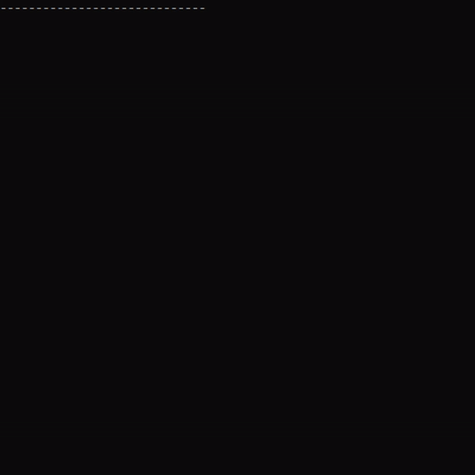
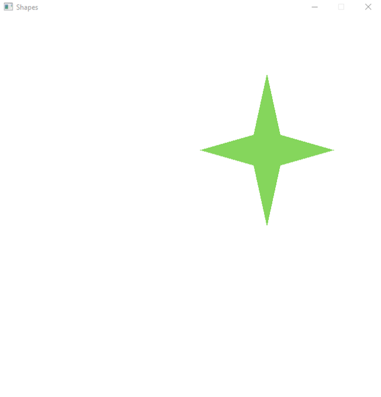
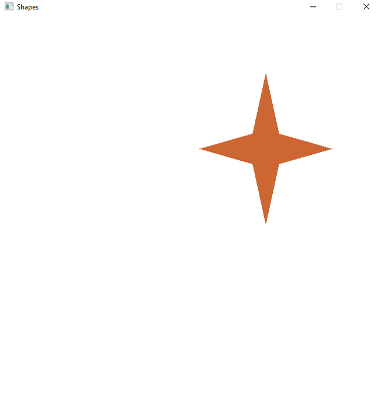
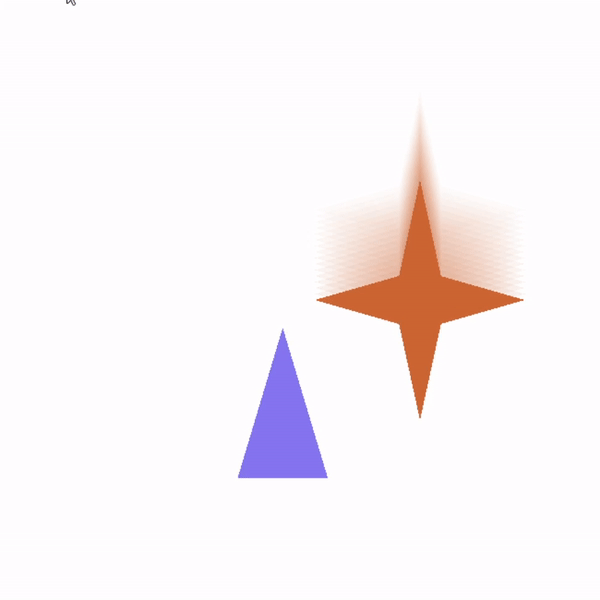
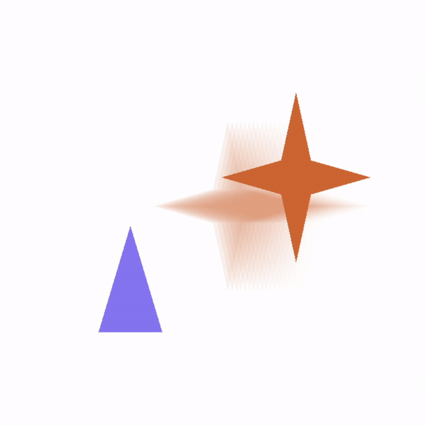
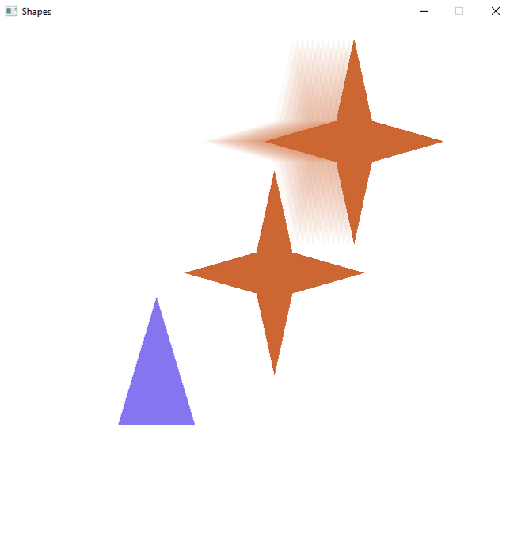
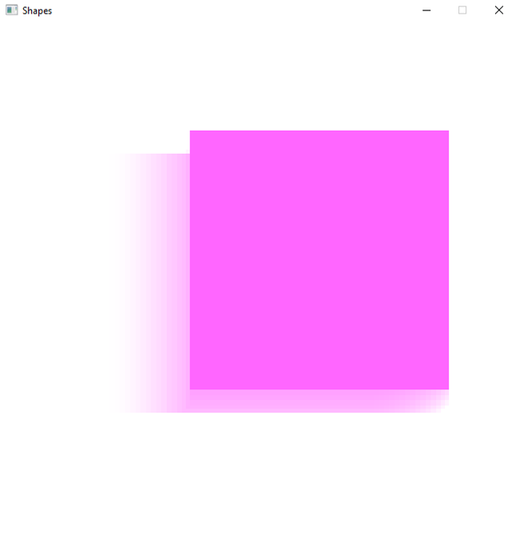
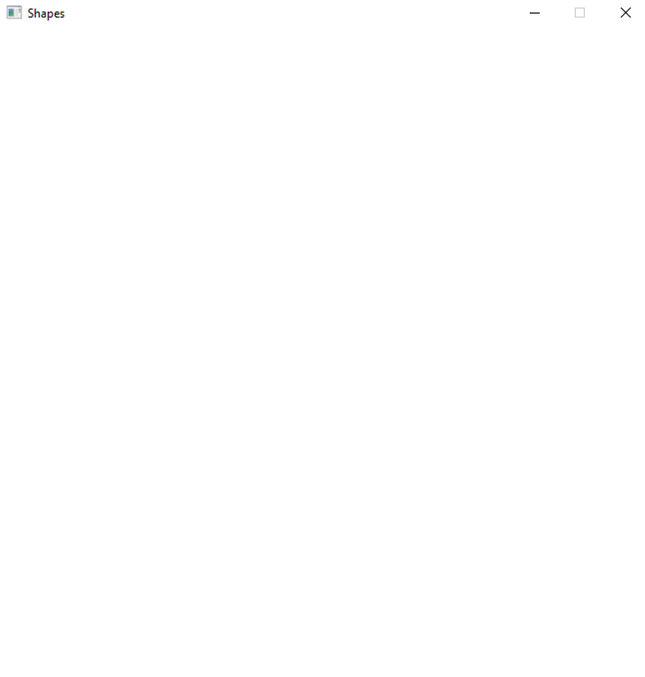
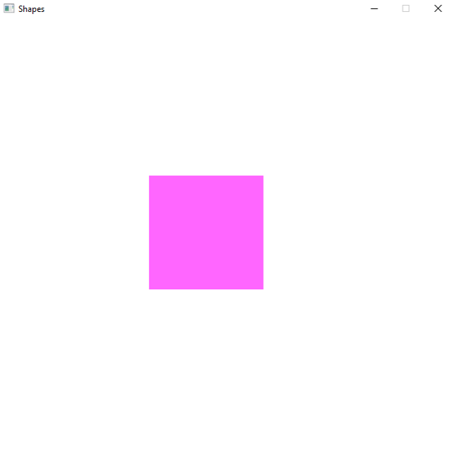

# OpenGL_Figures

OpenGL_Figures is an app written in C++ that allows you to draw pictures and create animations using some predefined shapes.

## Table of contents

- [About](#opengl-figures)
- [Technologies](#technologies)
- [Switching between console and canvas](#switching-between-console-and-canvas)
- [User interface](#user-interface)
  - [add](#add)
  - [edit](#edit)
  - [select](#select)
  - [record-play](#record-play)
  - [print](#print)
  - [save-load](#save-load)
  - [clone](#clone)
- [Other features](#other-features)
  - [Trail](#trail)
  - [Visibility](#visibility)
  - [Deformation](#deformation)

## Technologies

- [glew](http://glew.sourceforge.net/)
- [glfw](https://www.glfw.org/)
- [glm](https://github.com/g-truc/glm)

## Switching between console and canvas



## User interface

Console opens when the application starts.

List of available commands:

- `help` or `?`. Available commands will be displayed: `help`, `print`, `select`, `add`, `edit`, `load`, `save`, `clone`, `record`, `play` and `quit`
- `edit`. Allows you to edit the parameters of the shape by selecting it by id
- `add`. Creates a new shape or joins shapes. To create you need to enter the id of the parent union, the unique id of the new element, and its type and parameters
- `print`. Prints a tree-like structure of all elements located on the scene
- `select`. Selects an element that can be controlled using `WASD` in graphical mode
- `save`. Saves the current state of the scene to a file
- `load`. Loads the scene from a file
- `clone`. Clones a scene element. To clone, you must enter the element id and the new parent id
- `record`. Starts recording the trajectory of a certain shape
- `play`. Plays recording
- `quit`. Exits the console mode and opens a graphic scene with the ability to control the elements of the scene
- `F1` button. Pressing `F1` exits the scene view and enters the console.

### add

---

Let's add a star to the empty scene.

```
-----------------------------
add
Enter parent id: 0
Enter new item's id: 1
Enter type: <union/square/triangle/star/octagon>: star
Enter color <R, G, B, A> (0.0f - 1.0f), or type -1 to skip: 0.4 0.8 0.2 0.8
Enter scale <X, Y> (0.0f - 1.0f), or type -1 to skip: 0.7 0.8
Enter position <X, Y>, or type -1 to skip: 0.4 0.3
Enter hidden state (0, 1), or -1 to skip: 0
Enter deformed state (0, 1), or -1 to skip: 0
Enter trail state (0, 1), or -1 to skip: 0
-----------------------------
quit
-----------------------------
```



### edit

---

Let's change color and add a trail to the star.

```
-----------------------------
edit
Enter item's id: 1
Enter color <R, G, B, A> (0.0f - 1.0f), or type -1 to skip: 0.8 0.4 0.2 1
Enter scale <X, Y> (0.0f - 1.0f), or type -1 to skip: -1
Enter position <X, Y>, or type -1 to skip: -1
Enter hidden state (0, 1), or -1 to skip: -1
Enter deformed state (0, 1), or -1 to skip: -1
Enter trail state (0, 1), or -1 to skip: 1
-----------------------------
quit
-----------------------------
```



### select

---

```
-----------------------------
select 0
Enter id: Done
-----------------------------
quit
-----------------------------
```

Now we can control it using `WASD`.



Here we can see trail of the star.

I've added a triangle to demonstrate that union doesn't leave bounds of the window.

### record-play

---

Let's record the star's (id = 1) path when moving union (id = 0) with `WASD`.

```
-----------------------------
select
Enter id: 0
Done
-----------------------------
record
Enter id: 1
Start recording
-----------------------------
quit
-----------------------------
```


After recording is done, let's press `F1` to open console and play it.

```
-----------------------------
play
Start playing
-----------------------------
quit
-----------------------------
```



### print

---

Let's print the current scene structure.

```
-----------------------------
print
0) Type:Union
        1) Type:Shape, Color: (0.8, 0.4, 0.2) Scale: (0.7, 0.8) Position: (0.07, 0.0318877), Deformed: 0, Hidden: 0
        2) Type:Shape, Color: (0.2, 0.1, 0.9) Scale: (0.3, 0.5) Position: (-0.387572, -0.310539), Deformed: 0, Hidden: 0
-----------------------------
```

### save-load

---

Let's save the current scene state.

```
-----------------------------
save
Done
-----------------------------
```

Scene has been written to the file.

```
 type union id 0
 parent 0 type star id 1 scale 0.7 0.8 pos 0.07 0.0318877 color 0.8 0.4 0.2 1 isDeformed 0 isHidden 0 hasTrail 1
 parent 0 type triangle id 2 scale 0.3 0.5 pos -0.387572 -0.310539 color 0.2 0.1 0.9 0.6 isDeformed 0 isHidden 0 hasTrail 0
```

Now we can restart the app and load the scene.

```
-----------------------------
print
0) Type:Union
-----------------------------
load
Done
-----------------------------
print
0) Type:Union
        1) Type:Shape, Color: (0.8, 0.4, 0.2) Scale: (0.7, 0.8) Position: (0.07, 0.0318877), Deformed: 0, Hidden: 0
        2) Type:Shape, Color: (0.2, 0.1, 0.9) Scale: (0.3, 0.5) Position: (-0.387572, -0.310539), Deformed: 0, Hidden: 0
-----------------------------

```

### clone

---

Let's clone the star.

```
-----------------------------
clone
Enter id to clone: 1
Enter parent id: 0
-----------------------------
```



## Other features

### Trail

---

When adding or editing a shape you can add a trail. This can be undone.

```
-----------------------------
add
Enter parent id: 0
Enter new item's id: 1
Enter type: <union/square/triangle/star/octagon>: square
Enter color <R, G, B, A> (0.0f - 1.0f), or type -1 to skip: 1 0.4 1 1
Enter scale <X, Y> (0.0f - 1.0f), or type -1 to skip: 1 1
Enter position <X, Y>, or type -1 to skip: 0 0
Enter hidden state (0, 1), or -1 to skip: 0
Enter deformed state (0, 1), or -1 to skip: 0
Enter trail state (0, 1), or -1 to skip: 1
-----------------------------
select
Enter id: 1
Done
-----------------------------
quit
-----------------------------
```



### Visibility

---

When adding or editing a shape you can hide it. It will disappear from the canvas. This can be undone.

```
-----------------------------
edit
Enter item's id: 1
Enter color <R, G, B, A> (0.0f - 1.0f), or type -1 to skip: -1
Enter scale <X, Y> (0.0f - 1.0f), or type -1 to skip: -1
Enter position <X, Y>, or type -1 to skip: -1
Enter hidden state (0, 1), or -1 to skip: 1
Enter deformed state (0, 1), or -1 to skip: -1
Enter trail state (0, 1), or -1 to skip: -1
-----------------------------
quit
-----------------------------
```



### Deformation

---

When adding or editing a shape you can deform it. The size will be halved. Undoing deformation returns initial size.

```
-----------------------------
edit
Enter item's id: 1
Enter color <R, G, B, A> (0.0f - 1.0f), or type -1 to skip: -1
Enter scale <X, Y> (0.0f - 1.0f), or type -1 to skip: -1
Enter position <X, Y>, or type -1 to skip: -1
Enter hidden state (0, 1), or -1 to skip: 0
Enter deformed state (0, 1), or -1 to skip: 1
Enter trail state (0, 1), or -1 to skip: 0
-----------------------------
quit
-----------------------------
```


